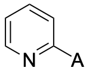

# HArD

<p align="center">
   
</p>

## Overview

HArD, **H**etero**Ar**yl **D**escriptors database comprises DFT-computed steric and electronic descriptors of >31,500 heteroaryl substituents. The database has 65 descriptors (38 electronic, 11 steric, 16 fingerprint) computed at the M06-2X/6-31+G(d)/SMD(water)//B3LYP-D3(BJ)/6-31+G(d) level of theory.

The database can be used in three ways:
1. Website: [hard.pengliugroup.com](https://hard.pengliugroup.com)
2. Download the Excel file `hard.xlsx` from this repository
3. Using a python script `hard.py`

The last option is recommended when searching for a large list of SMILES, for example, to study correlation with reactivity/selectivity or building machine learning (ML) models.

## Quick Start

1. Create a new Python virtual environment and install RDKit (2022.09.4) and pandas (1.5.3):
```bash
conda create -n hard_env python=3.11.0 -y 
conda activate hard_env
conda install -c conda-forge rdkit=2022.09.4 pandas=1.5.3 -y
```

2. Use curl or wget to download **hard.py** and **hard.db**:
```bash
mkdir hard && cd hard 
curl -O https://raw.githubusercontent.com/turkiAlturaifi/HArD/main/hard.py
curl -O https://raw.githubusercontent.com/turkiAlturaifi/HArD/main/hard.db
```

## Usage

You can use the hard.py script to search for heteroaryl descriptors from SMILES strings in two ways:

1. **A specific regioisomer**:  
   To search for a specific regioisomer, include a star in the SMILES string to represent a dummy atom. This is represented by the letter "A" in ChemDraw.
   For example, if you want to prepare SMILES string for 2-pyridyl, first draw a pyridine in ChemDraw, use dummy atom “A” to replace the C-H at the 2-position: 

   

   Select this structure. Then go to “Edit”, “Copy As …”, “SMILES”. This would copy the SMILES string of 2-pyridyl to clipboard: ```[*]C1=NC=CC=C1```

2. **All regioisomers**:  
   Searching by SMILES string of the parent heteroarene would provide all matched regioisomers. For example, if you input pyridine: ```C1=CC=CN=C1```
   it will return 2-pyridyl, 3-pyridyl, and 4-pyridyl.

## Command-Line Options

The `hard.py` script provides several options for searching and exporting data. By default, only selected descriptors are printed. 

- `--smi "SMILES"` or `-s "SMILES"` : search for descriptors using a SMILES string 
- `--export filename.csv` : export full output data to a CSV file.
- `--input_file filename.txt/csv` or `--infile filename.txt/csv` : provide a file (.txt or .csv) containing a list of SMILES (one per row). A CSV file with all the descriptors will be automatically generated.
- `--full` : show all descriptors
- `--electronic` or `--elec` : only electronic descriptors
- `--steric` : only steric descriptors
- `--fingerprint` : only fingerprint descriptors

## Examples

#### Example 1: electronic descriptors of 2-pyridyl 

```bash
python hard.py --smi "[*]C1=NC=CC=C1" --elec
```

#### Example 2: regioisomers of pyridine and export csv file

```bash
python hard.py --smi "C1=CC=CN=C1" --export output.csv
```

#### Example 3: List of SMILES from a file

Create a text file (e.g., `smiles.txt`) with each SMILES string in a separate line:
```
C1=CNC=C1
[*]C1=NC=CC=C1
CC1=CN=CN=C1
```
then run 
```bash
python hard.py --input_file smiles.txt --export descriptors.csv
```

## Generating the database: 
Source codes to generate the compound library, perform high-throughput DFT calculations, and extracting the descriptors are provided in the `gen_database` folder.


